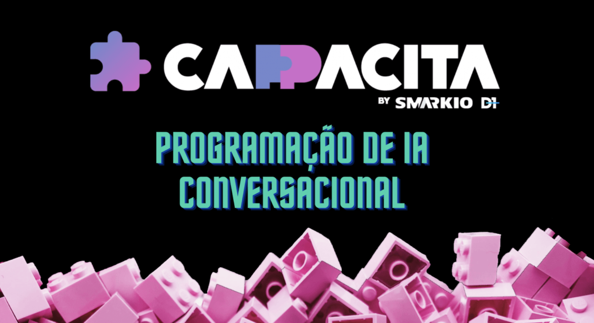

## CappacitaDev Project

#### Curso de programação de IAs Conversacionais da comunidade Cappacita by `Smarkio`.

  

---

- HTML
- CSS
- JS
- JSON
- CHATBOT

<a href='https://prime.altubots.com/chats/cappacita/b3869563899d9599d91147982ab3207c/index.html
/' target='_blank'>->Click aqu para testar **Chatbote**</a>

---

  <footer class="container">
            

            

            

            

                

                    <small>© 2021 Jair Neto. All rights reserved.
                            

                

            

    </footer>
